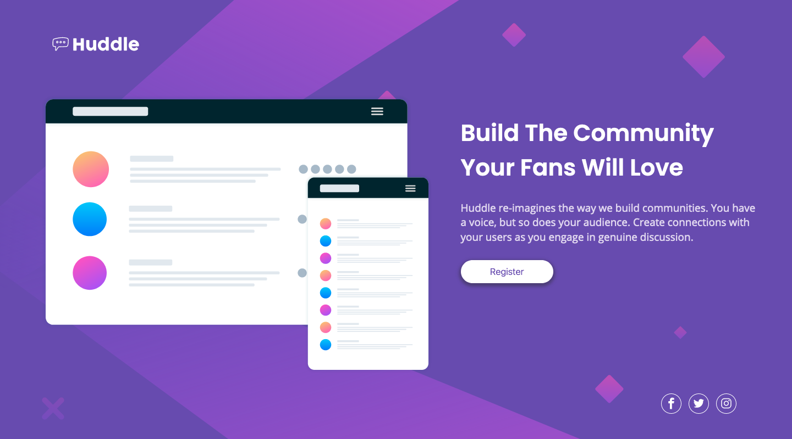

# Frontend Mentor - Huddle landing page with single introductory section solution

This is my solution to the [Huddle landing page with single introductory section challenge on Frontend Mentor](https://www.frontendmentor.io/challenges/huddle-landing-page-with-a-single-introductory-section-B_2Wvxgi0). Frontend Mentor challenges help you improve your coding skills by building realistic projects. 

## Table of contents

- [Overview](#overview)
  - [The challenge](#the-challenge)
  - [Screenshot](#screenshot)
  - [Links](#links)
- [My process](#my-process)
  - [Built with](#built-with)
  - [What I learned](#what-i-learned)
  - [Continued development](#continued-development)
  - [Useful resources](#useful-resources)
- [Author](#author)

## Overview

### The challenge

Coding Time : 9 hrs 47 mins

Users should be able to:

- View the optimal layout for the page depending on their device's screen size
- See hover states for all interactive elements on the page

### Screenshot



### Links

- Solution URL: [GitHub](https://github.com/Drallas/Huddle-Landing-Page)
- Live Site URL: [GitHub Pages](https://drallas.github.io/Huddle-Landing-Page/)

## My process

### Built with

- Semantic HTML5 markup
- CSS with custom properties (Still Holding back on the tempation to use SASS)
- BEM
- Flexbox
- Mobile-first workflow

### What I learned

I learned a lot during my second project. Still working to set-up an effective workflow. I didn't look at the previous project because I learn more doing this 'The Hard Way'. Yet I still struggle a bit with layout need to Google / Lookup basic things. I did my first CSS transitions and button shadow.  

```css
.container__text__button {
    width: 13rem;
    background-color: var(--HeaderColor);
    color: var(--Violet);
    border-style: none;
    box-shadow: 0px 3px 5px 3px var(--ButtonShadow);
    border-radius: 1.25rem;
    margin-bottom: 3.5rem;
    padding: 0.625rem;
    font-size: 1rem;
    font-weight: 300;
    transition: all 0.1s ease-in-out 0s;
}
```
### Continued development

My focus was on getting the responsive to be smooth and pleasant and be close to pixel 'perfect'. Also wanted to use transitions and correct colours, using a picker if needed to get the right hex value. Also want to use the Dev tools more to test assumptions and tweak the layout before I convert them to HTML / CSS. 

### Useful resources

- [CSS Filter Generator](https://codepen.io/sosuke/pen/Pjoqqp) - This helped me to turn the SVG buttons into the correct colors.
- [What are Semantic Tags](https://www.developerdrive.com/what-are-semantic-html-tags) - Learn more about Semantic Tags
- [Semantic HTML Explained](https://superdevresources.com/section-article-nav-aside-html5/) - This is helpful to understand when to use which Semantic Tag.
- [Typora](https://www.typora.io) - Handy Editor to Wysiwig edit these README.md files. I don't enjoy typing 'Raw' Markdown but i love the MD format!

## Author

- Frontend Mentor - [@Drallas](https://www.frontendmentor.io/profile/Drallas)
- Dev.to - [@Drallas](https://dev.to/drallas)


